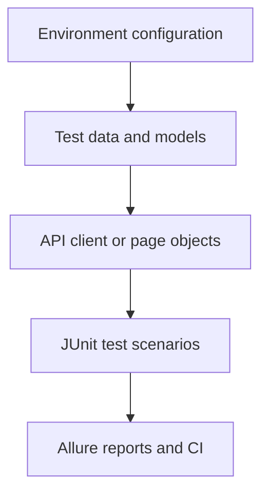

# Luminor – QA Automation Task (API & UI Tests)

This repository contains an automated test suite created for the Luminor QA Automation Engineer technical task.

It covers:

- API testing of the [Swagger Petstore](https://petstore.swagger.io/) /pet endpoints.
- UI testing of the [Luminor Latvia website](https://luminor.lv/en) - Financial Reports 2026 links.
- Sanity and regression execution through Gradle and GitHub Actions.
- Allure results, HTML reports, attachments, and suite-specific history.

## Test Scenarios

### API

The API tests use the Swagger Petstore `/pet` endpoints.

**Pet CRUD lifecycle**

- Create a pet.
- Retrieve the created pet.
- Update its name and status.
- Retrieve it again and verify that the changes were persisted.
- Delete the pet.
- Confirm that the deleted pet can no longer be retrieved.

**Optional pet fields**

- Create and retrieve a pet containing `category` and `tags`.
- Update the optional fields and verify that the new values were persisted.

Unique numeric identifiers and randomized names are generated for each test run to reduce collisions in the shared
public Petstore environment. Tests also perform cleanup when they create data successfully.

### UI

The UI test covers the following navigation flow on the Luminor Latvia website:

1. Open `https://luminor.lv/en`.
2. Handle the cookie consent dialog when it is displayed.
3. Open the hamburger menu.
4. Open the **About Us** section.
5. Navigate to **Financial Reports**.
6. Verify that the **2026** section is expanded.
7. Verify that a financial report link is present.

## Test Architecture

The project uses a layered test architecture to keep models, test-data creation, API communication, UI interaction,
configuration, and assertions separated.

This reduces duplication and allows each layer to change without requiring unrelated tests to be rewritten.

### Design Patterns

**Page Object Model**

The UI layer uses page objects to store selectors and user-facing actions. The test itself describes the business flow,
while `HomePage` and `FinancialReportsPage` contain the browser interaction details.

**Test Data Factory**

`PetDataFactory` creates valid Petstore payloads with unique IDs and randomized names. It also provides specialized
objects for updates and optional-field scenarios.

**API Client Layer**

`PetApiClient` centralizes RestAssured configuration and Pet endpoint operations. Tests call readable client methods
instead of repeating request construction.

**Environment Configuration**

`TestConfig` loads the selected properties file from `src/test/resources`. The default configuration points to the
public Swagger Petstore API and Luminor Latvia website. It can further be expanded to other environment specific urls if
desired.

## Tools

- Language: Java 21
- Build tool: Gradle 9.6 using the Gradle Wrapper
- Test framework: JUnit 5
- API automation: RestAssured
- UI automation: Selenide and Selenium WebDriver
- Assertions: Hamcrest and AssertJ
- Model generation: Lombok
- JSON mapping: Jackson
- Reporting: Allure Report with JUnit 5, RestAssured, and Selenide integrations
- CI/CD: GitHub Actions
- Report hosting: GitHub Pages for the regression report

## Running the Tests

### Prerequisites

- Java 21
- Chrome, Firefox, or Edge for UI execution
- Allure CLI available on `PATH`

The repository includes the Gradle Wrapper, so a separate Gradle installation is not required.

### Clone the repository

```bash
git clone https://github.com/SaadPasha/luminor-qa-automation-task.git
cd luminor-qa-automation-task
```

On Linux or macOS, make the wrapper executable if required:

```bash
chmod +x gradlew
```

### Run the sanity suite

```bash
./gradlew clean sanityTest
```

### Run the regression suite

```bash
./gradlew clean regressionTest
```

### Run UI tests headlessly

```bash
./gradlew regressionTest -Pheadless=true
```

### Select a browser

Chrome is used by default. A different browser can be selected with the `browser` Gradle property:

```bash
./gradlew regressionTest -Pbrowser=firefox -Pheadless=true
./gradlew regressionTest -Pbrowser=edge -Pheadless=true
```

The selected browser must be installed in the execution environment.

### Generate or open the Allure report

Each Gradle test task finalizes by running `allureReport`, so the HTML report is generated automatically at:

```text
build/allure-report/index.html
```

The report can also be regenerated from existing results:

```bash
./gradlew allureReport
```

## Test Suites

| Suite      | Gradle task      | Current coverage                                                                    |
|------------|------------------|-------------------------------------------------------------------------------------|
| Sanity     | `sanityTest`     | Pet CRUD lifecycle and Luminor Financial Reports UI flow                            |
| Regression | `regressionTest` | All API tests, including optional fields, and the Luminor Financial Reports UI flow |

The UI test currently carries both the `sanity` and `regression` JUnit tags. Consequently, both suites execute it.

## GitHub Actions Workflows

### Sanity workflow

File: `.github/workflows/sanity-tests.yml`

- Triggered by every push to every branch, excluding `master`
- Executes `./gradlew sanityTest`.
- Generates an Allure HTML report even when tests fail.
- Uploads raw Allure results for 7 days.
- Uploads the generated sanity report for 14 days.
- Maintains history separately for each branch using the cache prefix `allure-history-sanity-<branch>-*`.

The sanity report is stored as a workflow artifact. It is intentionally not deployed to GitHub Pages because a
repository has one Pages deployment target, and a sanity deployment would overwrite the regression report.

### Regression workflow

File: `.github/workflows/regression-tests.yml`

- Triggered when a pull request is closed against `master`.
- Executes `./gradlew regressionTest -Pheadless=true`.
- Generates an Allure HTML report even when tests fail.
- Uploads raw results for 7 days and the generated report for 14 days.
- Maintains regression-only history using the cache prefix `allure-history-regression-master-*`.
- Deploys the regression report to [GitHub Pages](https://saadpasha.github.io/luminor-qa-automation-task/).

Merging a pull request into `master` also creates a push to `master`. Therefore, both workflows run after a merge: the
sanity workflow handles the push event and the regression workflow handles the successfully merged pull request event.

### Allure history isolation

GitHub-hosted runners are temporary and do not retain files between executions. Each workflow therefore:

1. Restores only its own previous Allure history.
2. Copies that history into `build/allure-results/history`.
3. Runs the relevant tests and generates the new report.
4. Collects the updated `build/allure-report/history` directory.
5. Saves it under a suite-specific cache key.

Sanity and regression history cannot be mixed because their cache-key prefixes are different. Sanity history is
additionally separated by branch.

## Known CI Limitation: Cloudflare Verification

The Luminor website is a public production site protected by Cloudflare. Traffic from shared GitHub-hosted runners can
be classified as automated traffic and presented with an interactive **Verify you are human** challenge.

When the challenge appears, the test cannot reach the Luminor homepage elements. This is an external security
restriction rather than a failed application assertion or an unstable selector.

Because `FinancialReportsTest` belongs to both suites, this currently affects both workflows:

- The Petstore API scenarios may pass successfully.
- The Luminor UI scenario is blocked before normal navigation begins.
- The affected workflow is marked as failed because at least one included test failed.
- Allure results and reports are still collected to preserve the failure evidence.

In an internal test environment, the preferred solution would be an authorized Cloudflare exception for a dedicated
automation runner with a static outbound IP, or a test environment configured specifically for automation.

Therefore, for this technical task, the UI scenario can be executed locally when Cloudflare does not challenge the
connection. CI failures caused by the verification page should be reviewed separately from API test results.

## Project Structure

```text
├── .github/workflows
│   ├── regression-tests.yml       # Regression execution and GitHub Pages publication
│   └── sanity-tests.yml           # Push-triggered sanity execution
├── src/test/java
│   ├── api
│   │   ├── client
│   │   │   └── PetApiClient.java  # RestAssured client for Pet operations
│   │   ├── factory
│   │   │   └── PetDataFactory.java # Unique and reusable test-data generation
│   │   ├── model
│   │   │   ├── Category.java
│   │   │   ├── Pet.java
│   │   │   └── Tag.java
│   │   └── tests
│   │       ├── PetCrudFlowTest.java
│   │       └── PetOptionalFieldsTest.java
│   ├── config
│   │   └── TestConfig.java        # Environment property loader
│   └── ui
│       ├── BaseUI.java            # Shared Selenide configuration
│       ├── pages
│       │   ├── FinancialReportsPage.java
│       │   └── HomePage.java
│       └── tests
│           └── FinancialReportsTest.java
└── src/test/resources
    └── default.properties         # Default API and UI base URLs
```

## Project Flow



## Possible Improvements

- Execute UI tests against a dedicated, automation-friendly test environment.
- Add containerized browser execution for reproducible local and CI environments.
- Add API contract and negative-path coverage.
- Introduce retry handling only for clearly identified transient dependencies.
- Add structured execution metadata to Allure reports.
- Publish separate permanent sanity and regression report sites if multiple hosting targets become available.

For questions, please contact: `saadtahir96@outlook.com`
